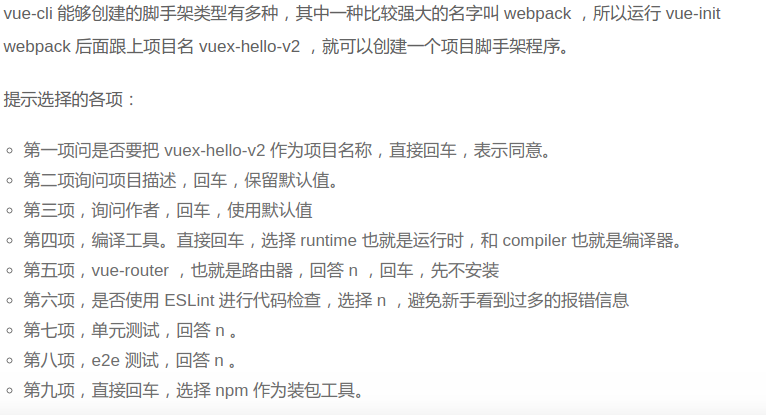
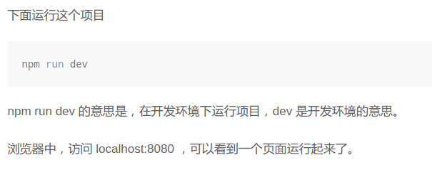
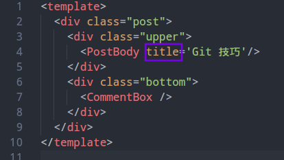

[TOC]
# 笔记
###  一些Linux基础命令
```
nvm install stable #安装最新稳定版 node 
sudo apt-get -install vscode  下载vsc编译工具
code . 打开vsc编辑器
ctrl+alt+T	打开命令行
pwd	在命令行内写	查看当前位置
ls	查看当前位置的文件(不包括隐藏文件)
ls -a 查看所有文件(包括隐藏文件)
ls --help	帮助
ls -A 查看所有的隐藏文件(比较-a查看的更多一些,一般不会用到)
clear 清空当前的所有内容	(被清除的内容是在上面而不是真正的被清空)
cd	进入文件夹(相对路径)
cd ../	返回上一个目录
touch 文件名(加上文件扩展名)	新建文档	如果想要创建多个就在名字后面添加空格就可以
mkdir 文件夹名		创建文件夹 如果想要创建多个在名字的后面名后面添加空格就可以
cat 文件名	查看文件内容
rm 文件名	删除
rm 文件夹名 -r	删除文件夹
rm -rf  文件名(或者文件夹)	强制删除
cp 文件名 文件夹名	复制某个文件到文件夹内	
cp -r 文件夹名 新文件夹名	 复制文件夹到新的文件夹内
cp 文件名 新文件名	重命名
mv 文件名(或者文件夹名)	剪切
~	代表用户主目录
/	代表用户根目录
./	代表当前目录
ctrl+c	结束当前命令
rm ./* 删除当前目录内的文件
```
### git 基本命令
```
在Linux 上安装git 	git在终端输入	sudo apt-get install git (意思是安装git)

windows 上安装git bash

在终端输入git clone 网上的那个地址 然后回车就可以把网上的仓库克隆到本地了

git log 查看版本号
git log --pretty=oneline	查看版本信息 每个版本信息在一行显示
git pull 把网上的版本拉倒本地,克隆网上的仓库到本地
git reset --hard HEAD^	本地仓库版本回退到上一个版本	多个^意思是返回多个版本
git reset --hard 版本号  本地参考回退到与版本号相对应的版本
git push -f	强制网上和本地仓库同步 覆盖网上版本
git reflog	查看git记录过得所有历史版本
git status	查看当前仓库的文件状态	(上传的时候不需要)
```
### 本地文件上传到仓库方法
```
git add .	将你的修改让git记录
git status	查看当前仓库的文件状态	(上传的时候不需要)
git commit -m '版本留言(写什么都可以但是必须写)' 	
git push	本地和网上同步  如果网上的更新和本地要提交的修改发生冲突 git pull 会失效, 
                需要在冲突的文件下手动解决冲突 手动解决冲突相当于再次修改 所以需要再次git add. git commit -m '版本信息' git push 提交信息
```
### git里面添加ssh  生成秘钥 方便不需要多次输入账号,迷码
```
命令行 ssh-keygen 一直回车 生成一个图片后	输如cd ~ 然后ls -a 看到有.ssh 文件 输入 cd .ssh 
然后ls 看到有两个文件 然后cat id_rsa.pub看到出现很多行的一个密码,复制它,
然后点开github 点击设置,然后点击ssh和gpg那个里面的ssh keys项,把上面复制的密码粘贴到这边,然后上传
```
### 在本地新建仓库的步骤
```
在网上新建仓库最好和本地的文件夹名相同
Initialize this repository with a README前面的不需要勾选
新建仓库 按照网上的步骤来就可以了 第一步是git init 初始化本地文件夹到git仓库
```

### git分支操作
```
git branch 分支名  (这是创建新的分支)
git branch  (意思是查看分支)
git checkout  分支名  (意思是切换分支) 
git checkout -b 分支名  (意思是新建分支,并且切换到新建的分支)
git branch -a   (查看所有的分支)
git branch -r   (查看所有网上的分支)
git branch -d 分支名   (删除本地的分支)
在新建分支的时候,新建的分支也有主分支的内容
git push --set-upstream origin dev(dev是新建的分支名)


下面的两步合在一起是删除网上的分支步骤
git branch -d -r orign/分支名  (删除网上的分支1)
git push origin :分支名  (删除网上的分支2)


git merge 分支名    (当前所在分支合并其他分支)
git merge   本地仓库已经合并分支的修改了 需要使用 git push 提交到远端

git pull origin master  当你在自己的分支想要查看主分支上其他同事提交需要执行上面的代码 拉取主分支上的更新 可以使用git push 推送到网上

gh-pages
访问方法 1:github用户名.github.io 仓库 直接访问仓库名就可以直接访问了
访问方法 2:若想要其他的仓库达到相同的效果,需要使用gh-pages分支
    方法:创建一个 gh-pages分支 把需要展示的页面 放到gh-pages 分支内,然后提交 之后访问(用户名.github.io/需要访问的仓库名)
```
```
git push --set-upstream origin dev(dev是新建的仓库名)
意思是在本地新建分支之后,网上没有分支,需要上面的命令才能推送到网上新建的分支(这句话会在git push 的时候出现,直接复制后,粘贴到下面回车就可以了)

```    


### 安装node.js
```
首先安装curl          命令行内写sudo apt-get install curl

nvm的意思是node 版本管理
安装方法:curl -o- https://raw.githubusercontent.com/creationix/nvm/v0.31.1/install.sh | bash   意思是安装nvm

nvm --version   查看当前的版本号
nvm ls-remote  查看所有的版本号
nvm install v8.11.1(这是node.js的版本号) 查看所有的版本号后下载最新的就可以了

npm init 初始化你的项目为 npm的项目,使用npm管理自己的项目依赖,会生成一个package.json 就成功了

npm install jquery --save   使用 npm 安装非工具类的依赖 (必须有,没有就不能执行,使用)
npm install webpack --save-dev  使用npm 安装工具类的依赖
--save-dev  可以换成-D 

安装后多了一个node_modules文件夹和package-lock.json文件

使用npm i 会将package.json 里面记录的所有项目依赖安装并且版本完全一致.

小提示json文件最后一项不需要加(,) 属性名和属性值都需要添加("") 
如果想要在命令行内输出 使用 npm run 属性名 方法输出

npm uninstall jquery 这是卸载jquery的方法 在命令行内写
npm i jquery@1 这是下载jquery1版本里面最高的那个

npm i -g 包名  这是在全局下安装包,在系统任何地方都可以使用或者查看   
使用 包名 .(可以查看)
```
### node 分三块 核心模块 第三方模块 自定义模块
```
核心模块 导入方式   require('模块名')
第三放模块 导入方式  fs require('模块名')
自定义模块  需要自己导入导出 

git 仓库根目录下的 .gitignore 文件 是忽略上传文件 里面写的内容上传的时候不会上传到git (需要在上传git之前建立)

.gitignore 里面写node_modules和package-lock.json两句话
```
### 安装环境 react服务
```
npm i -g create-react-app
npm update express          (更新react的版本)
create-react-app --version  (可以查看当前版本信息)
create-react-app 文件夹名    (这是新建一个react的环境文件夹)
```
### gitbook软件操作
```
gitbook操作网址
http://www.chengweiyang.cn/gitbook/introduction/README.html

最重要的一步下载node.js的方法 nvm install stable #安装最新稳定版 node 

用浏览器打开 http://127.0.0.1:4000 查看书籍的效果
```

### ES6
```
 数组、对象和字符串的解构赋值示例
 let a = 10
 console.log(a)


 let [a,b,c] = [10,20,30]
 console.log(a,b,c);     输出的是10,20,30


 let [q, ,w] =[1,2,3] 
 console.log(q,w); 输出的是1,3


 function getVal() {
     return [1, 2];
 }
 let [x, y] = getVal()函数返回值的解构
 console.log(x,y);  输出的是1,2


 let str = "hello"
 let [p,o,i] = str
 console.log(p,o,i); 输出的是h e l


 let user = {
     username:'zzt',
     age:20,
     touch:'三月',
     number:'苍月'
 }
 let {username,age,touch,number} = user
 console.log(username,age,touch,number);  输出的是zzt  20  三月  苍月     


 let user = {
     username:'zzt',
     age:20,
     touch:'三月',
     number:'苍月'
 }
 function show({number}){
     console.log(number);       输出的是苍月       这是对象的结构赋值
 }
 show(user)
```

### ES6箭头函数
```
 箭头函数
 箭头函数: 箭头函数简化了函数的的定义方式，一般以 "=>" 操作符左边为输入的参数，而右边则是进行的操作以及返回的值


 之前的函数式写法
 let fun = function(a,b){
     return a+b
 }
 console.log(fun(3,4));  输出的7


 箭头函数的写法   
 写法1: (参数) => 返回值
 写法2: (参数) => {操作 如果想要返回值的话    return}

 这是方法1
let fun = (a,b) => a+b
console.log(fun(3,4)); 输出的是7

 这是方法2
let num = (c,d) =>{
    return c+d
}
console.log(num(5,6));  输出的是11


 里面的参数:当参数不是一个的时候 使用()||(参数),如果只有一个参数,可以简写成 a=>{} 不写()也可以使用

 箭头函数内部的 this 指向 在声明的时候就规定好了
 当箭头函数 没有操作直接返回对象的话 使用({}) 来进行处理
```
### ES6 模板
```
使用`` 键盘esc下面的``来进行包裹 里面的变量名使用{} 来进行处理
let obj ={
    say:"sun",
    name:'123'
}
console.log(`my name is ${obj.say},my say is ${obj.name}`);  输出的是  my name is sun,my say is 123
```
### 函数的默认参数Default 和 剩余参数 Rest
```
一种写的方法
function sun(a,b){
    let x = a || 10
    let y = b || 20
    console.log(x*y);  输出的是200
}
sun()


另一种写的方法
function fun( a = 4, b = 20){
    console.log(a*b);  输出的是80
}
fun()


普通函数 arguments 
箭头函数没有 arguments 使用剩余参数代替
剩余参数,只能当做函数的最后一个参数
普通写法
function sum(){
    console.log(arguments);
}
sum(1, 2, 3, 4)  输出的是(4) [1, 2, 3, 4, callee: ƒ, Symbol(Symbol.iterator): ƒ]

箭头函数写法
let sum = (a,b,...rest) => console.log(rest);
sum(1,2,3,4,5)   输出的是 (3) [ 3, 4, 5]

```
### 扩展操作符
```
 之前的操作
 let arr = [1,2,3]
 let array = [4,5,6]
 let newArr = arr.concat(array,[55])
 console.log(newArr);  输出的是(7) [1, 2, 3, 4, 5, 6, 55]

 ES6操作
let arr = [1,2,3]
let array = [4,5,6]
let newArr = [...arr,...array,24,2,4]
console.log(newArr);   输出的是(9) [1, 2, 3, 4, 5, 6, 24, 2, 4]


对象的扩展操作符
let user = {
    name:'zzt',
    age:20
}
let arr = {
    num:'三月'
}
let newArr = Object.assign(user,arr)
console.log(newArr);  输出的是{name: "zzt", age: 20, num: "三月"} 但是后面的属性名会覆盖前面的属性名

let num = {...user,...arr}
console.log(num);     输出的是{name: "zzt", age: 20, num: "三月"} 但是后面的属性名会覆盖前面的属性名
```

### 数组
```
 indexOf  查找在数组的第一次出现的位置
 let a = [1,2,3,4,1,3,4]
 console.log(a.indexOf(4));  输出的是3
 filter 筛选
 map  映射
 数组.includes(元素)  意思是判断该元素在数组中是否存在,如果存在返回 true,如果不存在 返回 false
 reduce   累加
let username = [
    {
        name:'zzt',
        age:20
    },
    {
        name: 'qq',
        age: 32
    },
    {
        name: 'nn',
        age: 8
    },
]
console.log(username.find((item) => item.name === 'qq'));  输出的是{name: "qq", age: 32}


let newArr = username.filter(item => item.age<22)
console.log(newArr); 输出的是小于22的两个数组


let jun = [2,3,4,5]
let newNam = jun.map(item => item*item)
console.log(newNam); 输出的是[4, 9, 16, 25]

数组.includes(元素)  意思是判断该元素在数组中是否存在,如果存在返回 true,如果不存在 返回 false


a代表 最终的结果, b代表 数组的每一项 ,第二个参数 0 代表最终结果的初始值
let skt = [4,1,2,3,4].reduce( (a,b)=> a+b ,0)
console.log(skt);  //输出的是14


reduce 的一个例子
let a = [
    {
        goodName:'苹果',
        price:200,
        num:2
    },
    {
        goodName: '香蕉',
        price: 40,
        num: 1
    },
    {
        goodName: '油桃',
        price: 100,
        num: 3
    },
]
let b = a.reduce( (item,a) => item + a.price*a.num,0)
console.log(b);  //输出的是740


 return 实现 map 映射
let goodsArr = [
    {
        goodName: '油桃',
        id:123,
      },
    {
        goodName: '火龙果',
        id: 456,
    },
]
let obj = goodsArr.reduce((obj,item) => {
    obj[item.id] = item 
    return obj
},{})
console.log(obj);      输出的是123:{ goodName: "油桃", id: 123 }和456:{ goodName: "火龙果", id: 456 }


 reduce   实现filter

let goodsArr = [
    {
        goodName: '油桃',
        id: 123,
        stock:100
    },
    {
        goodName: '火龙果',
        id: 456,
        stock:150
    },
    {
        goodName: '苹果',
        id: 789,
        stock: 125
    },
]
let obj = goodsArr.reduce((obj,item) => {
    if (item.stock > 120) obj.push(item)
    return obj
},[])
console.log(obj)  输出的是大于120的两个数组 苹果和火龙果的那两个数组


 class 类

之前的写法,创建构造函数
 function Person(name) {
     this.name = name
 }
 Person.prototype.sayName = function(){
     console.log(`my name is ${this.name}`);
 }
  创建实例化类
 let zjh = new Person('朱军浩')

  继承
 function Man(){

 }
 Man.prototype = new Person('zzt')
 let zzt1 = new Man()


 console.log(zjh);
 zjh.sayName()  
 console.log(zzt1);  继承


使用es6 的语法
class Person{
     class 内部只能定义方法   方法之间不能写 
     constructor 属性返回对创建此对象的数组函数的引用。 是class的默认方法,不设置也会存在,这个方法在实例化对象的时候会立即执行
    constructor(name,age){
        this.name = name
        this.age = age
    }
    sayName(){
        console.log(`my name is ${this.name}`); 输出的是my name is zzt
        console.log(`my age is ${this.age}`);  输出的是my age is 18
    }
}
 let yl = new Person('杨亮','18')
 console.log(yl);

class Man extends Person{
    constructor(name,age,tal){
         必须写super() 如果该class 继承另外一个 class,该class的constructor 内部顶端必须执行super()
        super(name,age)
        this.tal = tal
    }
    say(){
        console.log('hello');
    }
}
 实例化类的时候,传递的参数首先要传递给这个类的constructor方法 然后 super 里面的参数传递给,继承的父类的constructor
let zzt = new Man('zzt','18','190')
zzt.sayName()
console.log(zzt); 输出的是Man {name: "zzt", age: "18", tal: "190"}
```
### es6 导入导出
```
1.命名导出 导入的时候 必须使用相同的名字 
```

```
如果直接写  import '地址'  是可以直接把另一边的全部导入过来,但是一般不会使用的
```
```
2.默认导出 默认导出只能导出一次 导出时可以随便命名
命名导入导出可以和默认导入导出同时存在
```


### AJAX 
```
原生的 ajax 请求 -->  jq 的请求 --> promise 类(fetch axios) 请求
 1.创建 XHLHttpRequest 对象
 2.使用该对象的 open方法,对的请求的方法和地址还有是否异步
   请求的方法GET(通常用来获取数据)  POST(通常用来传递数据)
  open() 第二个参数代表 请求的地址
  open() 第三个参数代表 请求是否异步 true 代表异步
 3.使用send()方法 发出请求
  GET请求发数据
 let xhr = new XMLHttpRequest()
 xhr.open("GET","http://api.github.com/users/Lmoxiaobei",true)
 xhr.send()
 xhr.onreadystatechange = function () {
      onreadystatechange 请求发出时的监听事件
     if (xhr.readyState === 4 && xhr.status === 200) {
          readyState 请求的状态    status 状态码
          responseText 后台响应之后返回的数据
          现在的 ajax 请求 返回的都是 json 字符串
          json 是一种数据类型,向后台传递 比较有优势, 体积小,传输快 易于处理
          将 json 数据转化为对象 JSON.parse(json数据)
          xhr.responseText请求后台的结果
         console.log(JSON.parse(xhr.responseText));
         console.log(xhr.responseText);
         root.innerHTML = `` 在页面生成图片
     }
 }

POST 请求发数据
let xhr = new XMLHttpRequest()
xhr.open("POST", "https://cnodejs.org/api/v1/accesstoken", true)
因为POST 请求 需要向后台传递数据 默认是xml 类型 现在都是json 类型 所以需要设置请求头 为json类型
xhr.setRequestHeader("Content-type","application/json")
  send (向后台发送的数据类型 必须是 json 类型)
xhr.send(`{"accesstoken":"d12252e5-503c-488b-839f-4e7441c6dafc"}`)
xhr.onreadystatechange = function () {
    if (xhr.readyState === 4 && xhr.status === 200) {
        console.log(JSON.parse(xhr.responseText));
        root.innerHTML = ``  在页面生成图片
    }
}


jquery 的 GET 请求
import $ from 'jquery'
 快捷键 jqajax 回车
$.ajax({
    type:'GET',
     type 请求的类型
    url:"https://api.github.com/users/Lmoxiaobei",
     url 请求的地址
    success:function(data){
         success 请求成功之后 执行的函数 里面的参数代表 返回的数据类型
        root.innerHTML = ``
        console.log(data);
    },
    error:function(err){
        console.log(err);
    }
})


 jquery 的POST 请求
 import $ from 'jquery'
 $.ajax({
     type: "POST",
     url: "https://cnodejs.org/api/v1/accesstoken",
     data: {accesstoken: "d12252e5-503c-488b-839f-4e7441c6dafc"},
      data 想后台传递的数据 没有必要设置成 json格式,直接传递对象即可 因为jq内部已经自动转换了
     success: function (response) {
          对数据进行处理
         root.innerHTML = ``
         console.log(response);
     }
 });
```

### axios
```
在项目里面 下载 npm i axios --save

 axios 相关网址 https://www.npmjs.com/package/axios
 axios get方法
 import axios from "axios";
 axios.get('https://api.github.com/users/Lmoxiaobei')
  .then 成功之后 执行的函数 该函数里面的参数 是一个axios 自定义对象 该对象下有一个 data 属性 这个属性就是后台响应的数据
     .then(function (res) {
         console.log(res.data);
         root.innerHTML = ``
     })
     .catch(function (error) {
         console.log(error);
     });


 axios post方法
import axios from "axios";
axios.post('https://cnodejs.org/api/v1/accesstoken', {
    accesstoken: "d12252e5-503c-488b-839f-4e7441c6dafc"
})
     
    .then(res => console.log(res.data))
    .catch(err => console.log(err))

 同时两个请求写法

 import axios from "axios";
 function getUser1(){
     return axios.get('https://api.github.com/users/Lmoxiaobei')
 }
 function getUser2() {
     return axios.get('https://api.github.com/users/fnyangyu')
 }
 axios.all([getUser1(),getUser2()])
 .then(function(acct){
      两个请求全部结束之后,要做的事情
     console.log(acct[0].data);
     console.log(acct[1].data);
 })


  结构赋值
 let post = {
   body: 'hello'
 }
 let sayHello = ({ body }) => {
   console.log(body)  输出的是hello
 }
 sayHello(post)
```
### VUE
```
打开 网址   https://cn.vuejs.org/
点击起步
Vue 是一个框架 英文叫framework 框架是,框架作者精心挑选的一系列 js 库的集合.
这些形成了一套完整的写 Web APP 的思路
Web app 或者叫网页 app是基于浏览器运行的 APP 或者就是带更多功能的网站 
```

vue-cli 搭建开发环境
```
首先参考[ Vue-cli](https://github.com/vuejs/vue-cli) 的官网，来搭建脚手架。
```
[Vue-cli](https://cn.vuejs.org/)官网
  
```
在命令行内 写 npm i -g vue-cli 来进行安装 Vue环境

安装 vue-cli 。cli 的意思是**命令** 。vue-cli 是用来快速搭建 vue 开发环境的命令行工具。

在命令行内 输入 vue-init webpack demo 安装vue的 webpack环境  demo的意思是安装vue时下载的文档名字

Vue 开启的命令是 npm run dev (在命令行内写)
```





```
@click 这是vue的点击事件
:  意思是v-bind 的事件  动态属性
@ 在导入文件的时候可以代替../

v-for 这是vue 的使用map方法 用来遍历数组  但是一般会在前面写 :key 
列表的每一个元素都要添加一个独立的 key 。不然可以看到编辑器中有语法错误提示。
同时 vue 规定，v-for 不能用在顶级组件中，所以要把外部包裹一层 div 。

```

这里的title是一个属性  在html里面起名使用的 class 其实就是一个属性  
title 就是前面的PostBody的属性


